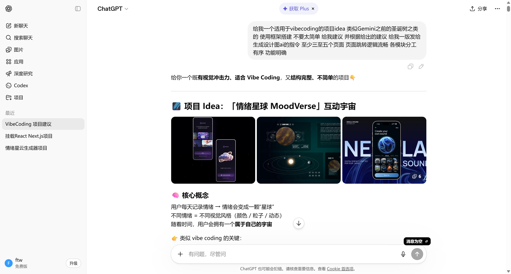
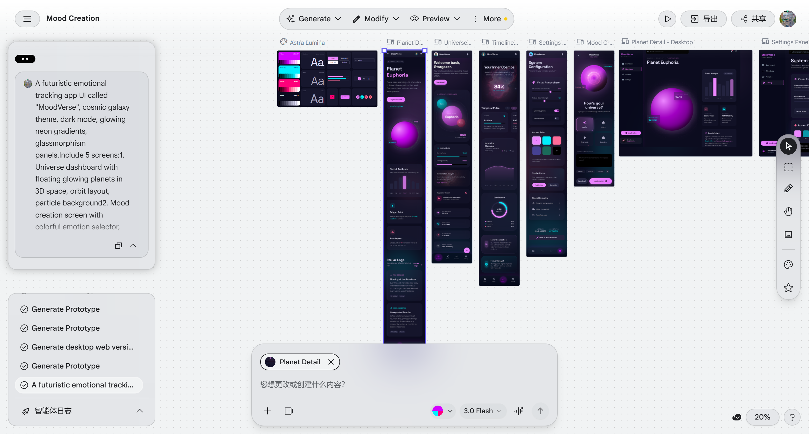
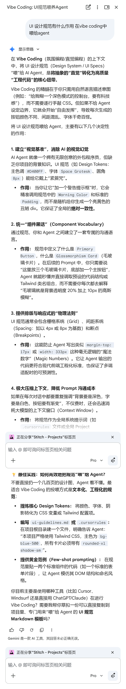
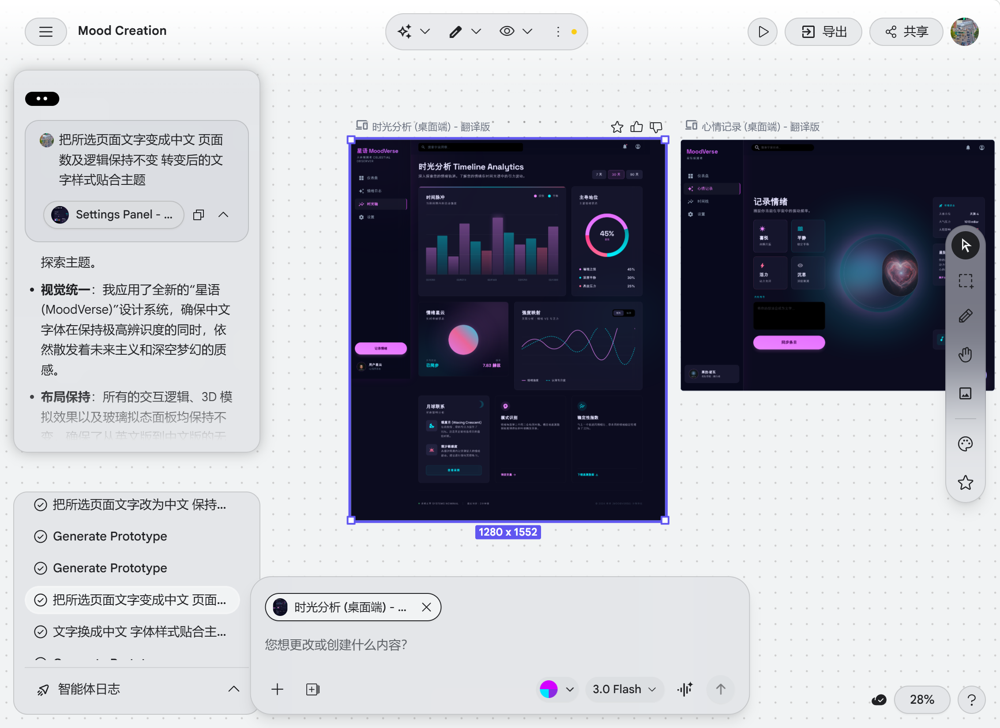
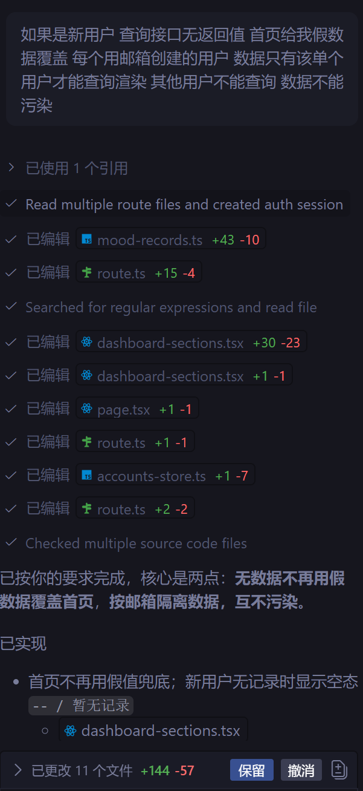

# MoodVerse 项目 Idea 与设计落地方案（GPT + Stitch + Figma + Agent）

## 0. 文档用途

本文件可直接用于课程 PPT 与项目执行，覆盖以下要求：

1. 封面信息
2. 项目概述（1 分钟）
3. Vibe Coding 技术应用（3 分钟）
4. 项目演示（2 分钟）
5. 总结与反思（1 分钟）

---

## 1. 封面信息（可直接填入 PPT）

- 项目名称：**基于 Next.js 的情绪可视化交互系统设计与实现**
- 小组成员与分工：
  - A：产品与提示词设计（GPT / Stitch）**刘雅骏 刘安琪**
  - B：前端实现与交互动效 **刘雅骏**
  - C：后端接口与数据持久化 **刘雅骏**
  - D：测试、演示与汇报整理 **刘安琪**

---

## 2. 项目概述（1 分钟口径）

### 2.1 选题背景

大学生和初入职场用户常见情绪波动，但传统日记工具记录成本高、坚持难。我们希望做一个低门槛、可视化、可持续的情绪管理产品。

### 2.2 核心功能

1. 快速情绪打卡：30 秒完成一次记录（心情 + 能量 + 触发因素）。
2. 情绪星球可视化：用动态图形映射近期状态变化，提高反馈直观性。
3. 趋势分析：按周/月给出波动趋势、稳定度与高频触发因素。
4. 个性化建议：根据历史记录生成可执行建议（作息、社交、学习节奏）。
5. 隐私控制：账号隔离、会话鉴权、一键清除个人数据。

### 2.3 设计思路

- 先降低记录成本，再提供反馈价值。
- 以视觉反馈提升持续使用意愿。
- 用结构化数据替代长文本，方便统计与分析。

### 2.4 难点、亮点与趣味点

- 难点：
  - 情绪数据主观性强，如何保证记录结构可分析。
  - 可视化既要美观，也要避免信息噪声。
  - 记录效率不够极致 `解决方法: 首页新增快记功能`
  - 迁移成本高 `个人页面新增json导入导出功能`
- 亮点：
  - **GPT 参与需求拆解与提示词迭代**：快速完成方向发散与可行性收敛。
  - **设计图 Prompt 由 GPT 生成并驱动 Stitch**：缩短从需求到高保真页面的路径。
  - **过程内置 UI 设计规范**：统一色彩、排版、间距与组件状态，减少风格漂移。
  - **Stitch 产物微调后导入 Figma**：沉淀可复用组件与可交付设计标注。
  - **使用GPT-5.3-CODEX全程开发**
  - **Agent 按设计图编写项目**：确保视觉还原和交互一致。
  - **项目托管到 GitHub 且关键改动即时 push**：保障版本可追溯与协作效率。
  - **采用 Agent 默认审批机制**：降低自动化越权风险。
  - **限制 AI 高危操作权限**：杜绝误删核心文件。
  - **技术库落地清晰：**Next.js、React、TypeScript、three、@react-three/fiber、@react-three/drei、framer-motion、recharts、swiper、jose、lucide-react、react-range
  - **Next API 覆盖完整**：POST /api/login、POST /api/logout、GET/POST/DELETE /api/mood、POST /api/mood/import、GET /api/metrics、POST /api/engagement、DELETE /api/account，**形成鉴权、记录、分析、导入、埋点与账号管理闭环**
- 趣味点：
  - 情绪映射为“星球状态”，不同情绪对应不同颜色星球，让数据有生命感。


github


## 3. GPT 生成项目 Idea 的提示词（可复制） 第一版



---

## 4. Stitch 设计图 Prompt

```text
A futuristic emotional tracking app UI called "MoodVerse", cosmic galaxy theme, dark mode, glowing neon gradients, glassmorphism panels.

Include 5 screens:
1. Universe dashboard with floating glowing planets in 3D space, orbit layout, particle background
2. Mood creation screen with colorful emotion selector, gradient buttons, live preview of a glowing planet
3. Planet detail screen with large interactive sphere, animated particles, emotional data overlay
4. Timeline analytics screen with neon charts, circular graphs, glowing nodes
5. Settings panel with theme customization sliders, color pickers, soft glass UI

Style: dreamy, cosmic, minimal yet rich, smooth gradients, soft glow, volumetric lighting, depth, modern UI/UX, Apple + sci-fi style

Highly detailed UI, mobile app design, consistent design system, smooth transitions between screens
```



---

## 5. UI 设计规范（可直接放进设计说明）

该部分用于建立“视觉基准”，消除 AI 的视觉幻觉，避免ai感的居中展示+无意义背景线性渐变+过度圆角和阴影

详细见下



---

## 6. Stitch 结果导入 Figma 与微调流程



1. 在 Stitch 中生成桌面版与移动版高保真页面。
2. 检查图层命名：页面、区块、组件、状态命名统一。
3. 导出可编辑设计文件（优先可编辑格式，其次 SVG 分层导入）。
4. 在 Figma 中导入后先做结构清理：
   - 合并重复图层
   - 重命名组件
   - 建立页面分组（Desktop / Mobile / Components）
5. 建立 Variables（Color / Spacing / Radius / Shadow / Typography）。
6. 将重复元素抽象为组件与变体：Button、Input、Card、Tabs、Toast。
7. 全局替换本地样式为 Variables，确保后续开发可映射。
8. 用 Auto Layout 修正对齐、间距与拉伸规则。
9. 补齐交互原型：页面跳转、按钮反馈、空态切换。
10. 输出开发标注：尺寸、间距、颜色、字体、状态说明。

---

## 7. Agent 按设计图编写项目的第一版执行 Prompt


---

## 8. Vibe Coding 迭代案例（用于 PPT 第 3 部分）

### 8.1 迭代链路

- 初始提示词：只描述“做一个情绪管理页面”。
- 测试反馈：样式同质化、信息层级不清晰、移动端可用性一般。
- 优化提示词：按页面级审查，补充页面结构、组件状态、可访问性、动效约束。
- 最终提示词：加入 Token 规范、导入 Figma 的图层命名要求、开发映射约束。

### 8.2 调试 AI 代码的方法

1. 先修逻辑，再修样式，最后修交互。
2. 每次只改一个问题簇（例如先解决登录流程）。
3. 用页面回归清单验证：登录、记录、分析、清除数据。
4. 为关键分支补最小测试：空态、错误态、无权限态。

### 8.3 可以展示的优化逻辑 增加两个页面的所有提示词及优化流程 login index

- 从“能生成页面”升级为“能稳定落地开发”。
- 从“视觉好看”升级为“可维护、可复用、可扩展”。
- **login 登录及注册流程**


- **首页**




---

## 9. 项目演示（2 分钟话术模板）

1. 登录：展示会话鉴权成功与受保护路由。
2. 新建情绪：快速记录一条情绪数据。
3. 分析页：展示趋势、触发因素、建议卡片。
4. 时间线：展示日级记录与周趋势。
5. 设置页：执行数据清除并回到分析页验证结果。

收尾一句：系统已完成“记录-分析-反馈-隐私控制”闭环。

---

## 10. 总结与反思（1 分钟）

### 10.1 收获

- 学会了把 GPT 用于需求拆解与提示词迭代。
- 学会了 Stitch 到 Figma 再到代码的设计交付流程。
- 学会了在 AI 辅助开发中控制质量与回归验证。

### 10.2 问题与解决

- 问题：初版提示词过于抽象。
- 解决：增加结构化约束、状态约束与验收标准。

- 问题：设计稿与代码风格不一致。
- 解决：建立 Token 映射与组件规范，减少硬编码。

### 10.3 未来优化方向

1. 增加多维度情绪标签与更长周期分析。
2. 接入模型做更个性化建议。
3. 增加导出报告与社群支持能力。
